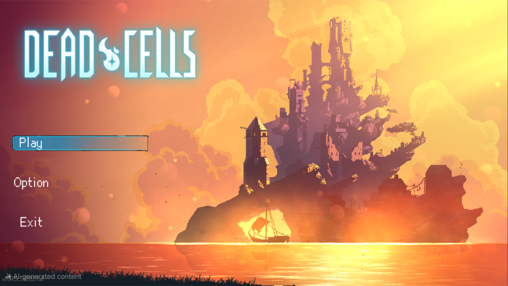
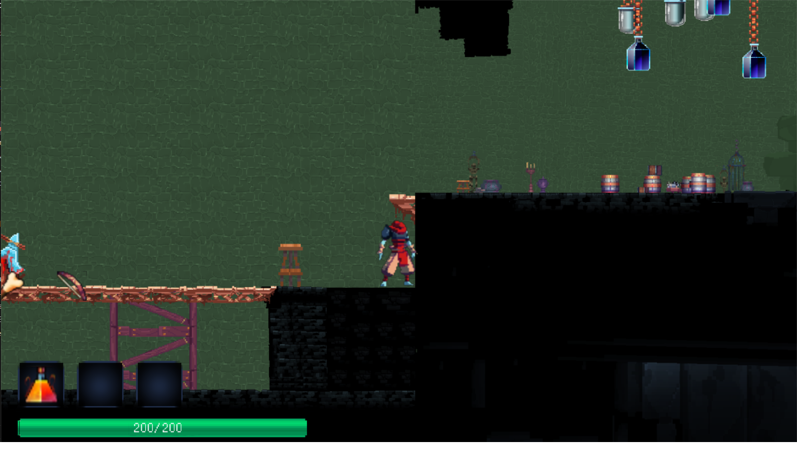
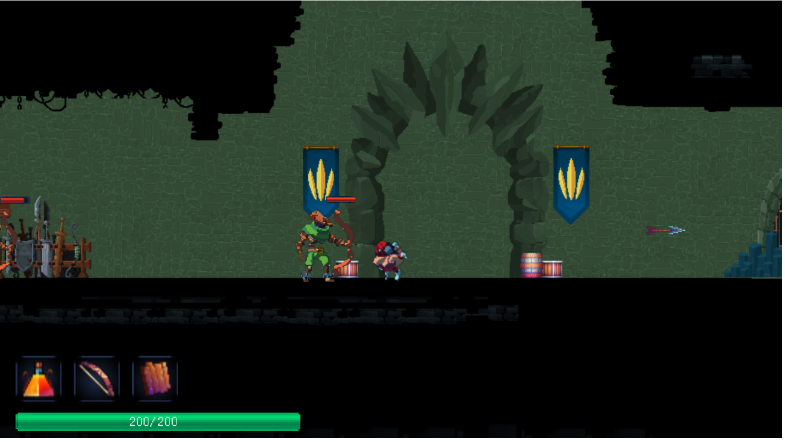
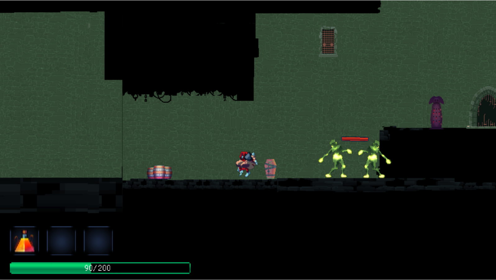
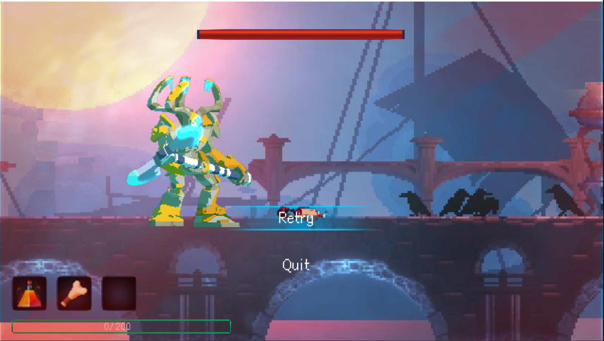

# 國立臺北科技大學

2024 資工系物件導向程式設計實習

## 期末報告

**Dead Cells**

第15組  

黃力安、劉玉凱

---

## 目錄

1. 專案簡介  
    1. 遊戲簡介
2. 遊戲介紹  
    1. 遊戲規則  
    2. 遊戲畫面
3. 程式設計  
    1. 程式架構  
    2. 程式技術
4. 結語  
    1. 問題及解決方法  
    2. 貢獻比例  
    3. 自我檢核表  
    4. 收穫  
    5. 心得、感想  
    6. 對於本課程的建議

---

## 一、專案簡介

### 1. 遊戲簡介

《死亡細胞》（Dead Cells）是一款結合 Roguelike 與類銀河戰士惡魔城要素的遊戲。玩家扮演一個被不明細胞寄生的屍體，在地牢中探索尋找出路。途中會遇到各式武器裝備、道具可供收集，但同時也需警惕陷阱與敵對生物。

### 2. 組別分工

- 黃力安：遊戲主程式設計，怪物 AI、戰鬥系統、UI 設計
- 劉玉凱：角色控制與地圖生成，報告

---

## 二、遊戲介紹

### 1. 遊戲規則

遊戲地圖為被囚者的牢房。玩家需擊敗怪物、收集武器裝備、金錢及「細胞」。細胞可由擊殺敵人獲得，作為貨幣與 NPC 交換新能力或裝備，例如增加回血藥劑使用次數、提升金錢回收量、改變武器屬性等。  
怪物有兩種：zombie（近戰攻擊）與 archer（遠程攻擊）。玩家可在地牢中收集不同武器（如槌子、盾牌等），各自具有不同傷害與功能。

### 2. 遊戲畫面

---

## 三、程式設計

### 1. 程式架構

[架構](https://deepwiki.com/wolaxH/OOPL-Dead-cells)

### 2. 程式技術

- 採用物件導向程式設計，將遊戲元素（如角色、怪物、武器、關卡）分別封裝為類別，各自負責屬性與行為。

- 模組化開發，將不同功能拆分為獨立模組（如地圖生成模組、戰鬥模組、道具管理模組等），便於維護與測試。

- 參考 LangChain 的「鏈」設計，將遊戲流程（如開始遊戲、戰鬥、收集物品、升級）以鏈式方式組合，並可根據遊戲進度動態調整。

- 使用設計模式（如工廠模式、策略模式）提升程式彈性，讓未來擴充新功能（如新增怪物、武器）更為容易。

- 強調元件間的解耦，讓各模組能獨立更新或重構，減少相互影響。

---

## 四、結語

### 1. 問題及解決方法

- **地圖生成問題**  
  前期地圖時常出現破圖問題，地圖聯通性檢查，確保每個房間至少有一條可通行路徑，並適當減少死路數量，提升遊戲體驗。

- **怪物AI追擊Bug**  
  前期怪物巡邏、偵測範圍及攻擊策略，怪物攻擊玩家造成遊戲崩潰，後續修改過後，遊戲不在崩壞，並讓怪物能根據玩家距離作出不同反應，提升遊戲難度與趣味性。

- **怪物攻擊碰撞箱 bug**  
  初期怪物攻擊判定有誤，常常出現攻擊未命中玩家卻觸發傷害、或攻擊範圍錯誤的 bug。經debug後，重新調整碰撞箱的範圍與判斷方式，並多次測試以確保怪物攻擊範圍與動畫同步，成功修正此問題。

- **專案協作溝通障礙**  
  一開始分工不明確，導致部分功能重複開發或進度落後。經檢討後定時進度回報，並明確分配各自負責的模組，有效提升團隊協作效率。

### 2. 貢獻比例

- 黃力安：60%（主程式、角色、戰鬥、UI）
- 劉玉凱：40%（怪物分配、地圖）

### 3. 自我檢核表

- [v]完成協議書上所描述的最小關卡數量。
- [v]完成專案權限改為 public。 
- [v]具有 debug mode 的功能。
- [v] 物件導向設計
- [v] UI/UX 完成
- [v] 報告內容簡意理解

### 4. 收穫

透過這次以 C++ 撰寫遊戲的經驗，我深刻體會到開發大型專案時，必須持續優化程式碼功能，才能避免遊戲執行時出現卡頓問題，並有效提升遊戲效能。在設計主角（player）時，原本的架構並未內建跳躍、下落等動作，因此整合並參考外部函式庫的計算方式，成功實現這些功能。

### 5. 心得、感想

這次開發遊戲的課程，受益匪淺，不僅學到了許多 C++ 的功能寫法，也培養了我們如何準確分配自己的時間，提升了專案管理能力。在開發過程中，遇到困難時也多虧助教在 demo 期間給予建議，讓我們能夠及時發現並修正問題，最終順利完成專案。這段經歷讓我們對遊戲開發與團隊合作都有更深刻的體會，也增強了解決問題的能力。
### 6. 對於本課程的建議

架構有點限制得太死，導致製作遊戲有些會有些阻礙
